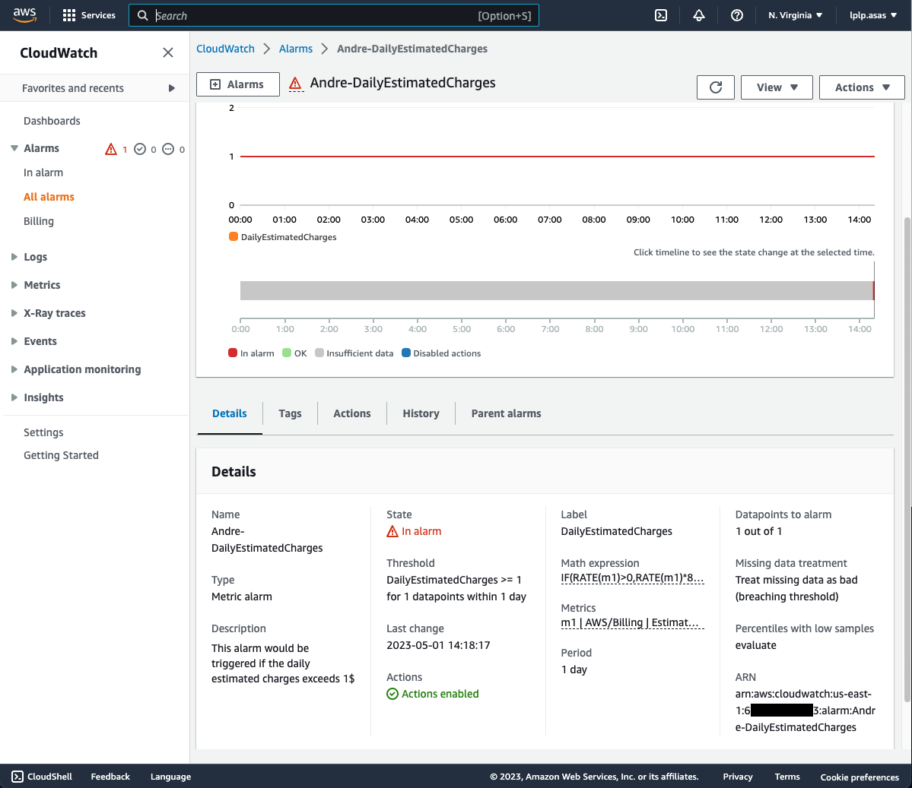
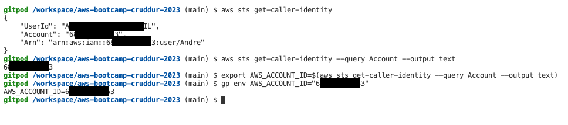

# Week 0 — Billing and Architecture

## Getting the AWS CLI Working

### Install AWS CLI
Signup to gitpod using github and start installing AWS CLI when Gitpod launches


### Create a new User and Generate AWS Credentials

Created new user called Andre and created Access Key as well


### Set Env Vars


### Check that the AWS CLI is working and you are the expected user

Run this code in terminal and get the caller identity

```
aws sts get-caller-identity
```


### Enable Billing


### Creating a Billing Alarm

#### Create SNS Topic

1. Create SNS Topic and subscribe supply the TopicARN


> Make sure topic is created through AWS console


2. Confirm the subscription from received email from AWS


> Make sure topic's subcription is confirmed through AWS console


#### Create Alarm


> Make sure alarmed is created through AWS console and suddenly get email from it




### Create an AWS Budget

1. Get AWS Account ID and set it as env



2. Update json files by copying example from budget.json & budget-notifications-with-subscribers.json


3. Create budget using cli command


