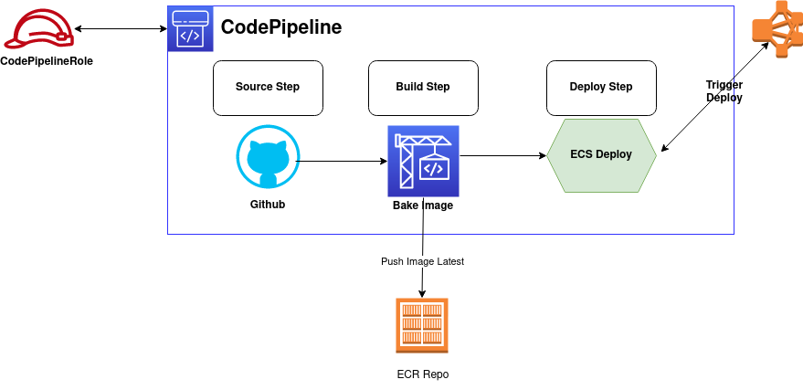
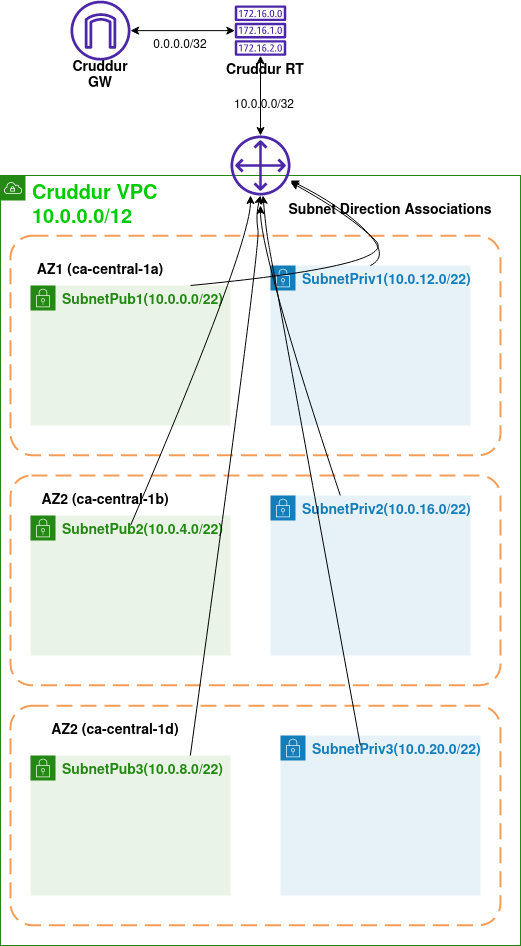

# Week 10 — CloudFormation Part 1

## CI/CD

### Install cicd
For install cicd can use script [here](backend-flask/bin/cfn/cicd)

CICD Diagram can check [here](assets/CICDDiagram.drawio)

## Cluster

### Install Cluster
For install cluster can use script [here](backend-flask/bin/cfn/cluster)

## DB

### Install DB
For install DB can use script [here](backend-flask/bin/cfn/db)

## Frontend

### Install Frontend
For install frontend can use script [here](backend-flask/bin/cfn/frontend)

## Networking

### Install Networking
For install networking can script [here](backend-flask/bin/cfn/networking)

Network Layer Diagram can check [here](assets/NetworkLayerDiagram.drawio)

## Service

### Install Service
For install service can script [here](backend-flask/bin/cfn/service)
