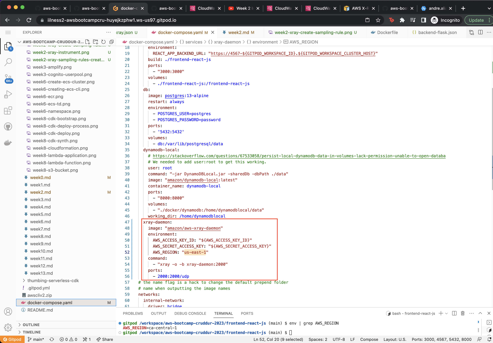

# Week 2 — Distributed Tracing

### 1) X-Ray

#### Instrument AWS X-Ray for Flask

#### Add AWS x-ray pkg to requirements

#### Install pip depencies

#### Add AWS x-ray config to `app.py`

#### 2) Setup AWS X-Ray Resources

#### Add `aws/json/xray.json`

#### Create flask address

#### Create Sampling rules

#### Check the sampling rules in aws console

### Add Deamon Service to Docker Compose

#### Add env vars to backend-flask in `docker-compose.yml` file

#### Run app and check the tracer

### HoneyComb
#### Add honeycomb requirement in `requirements.txt`

#### Install pip depencies

#### Add honeycomb config to app.py

#### Set Open Telemetry config to docker compose

#### Set honeycomb env

#### Run the app and check honeycomb dashboard

### CloudWatch Logs

#### Add to the requirements.txt

#### Install pip depencies

#### Add Logs config to app.py

#### Set the env var in backend-flask for `docker-compose.yml`

#### Check log in log groups

### Rollbar

#### Create a new project in Rollbar called Cruddur

#### Add rollbar pkg to requrements file

#### Install pip depencies

#### Set access token for rollbar

#### Add to backend-flask for docker-compose.yml

#### Add rollbar config to app.py

#### Run app and check rollbar dashboard

