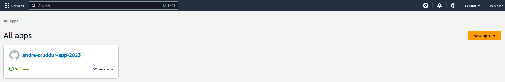
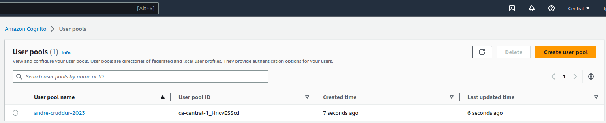

# Week 3 — Decentralized Authentication

## Amplify
Amplify create from console can see 

## Cognito
Cognito create from console can see 

## Integration with Cognito
### show components based on logged in or logged out

* [HomeFeedPage.js](frontend-react-js/src/pages/HomeFeedPage.js)
* [DesktopNavigation.js](frontend-react-js/src/components/DesktopNavigation.js)
* [ProfileInfo.js](frontend-react-js/src/components/ProfileInfo.js)
* [DesktopSidebar.js](frontend-react-js/src/components/DesktopSidebar.js)

### Signin Page
[SigninPage.js](frontend-react-js/src/pages/SigninPage.js)

### Signup Page
[SignupPage.js](frontend-react-js/src/pages/SignupPage.js)

### Confirmation Page
[ConfirmationPage.js](frontend-react-js/src/pages/ConfirmationPage.js)

### Recovery Page
[RecoverPage.js](frontend-react-js/src/pages/RecoverPage.js)
