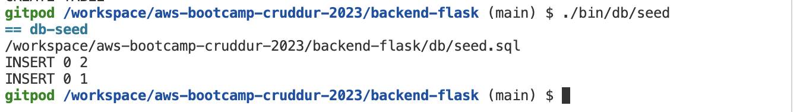

# Week 4 — Postgres and RDS

## Postgres
### Check local postgres connection and create cruddur db

### Check database list

### Add connection url env

#### Check connection using env

### Add schema sql script

### Add db seed script

### Add db script

#### Add setup script

#### Add sessions script

#### Add seed script

#### Add schema load script

#### Add drop db script

#### Add create db script

#### Add connect script

### Check db script

#### Run create db

#### Run db schema

#### Run db seed

#### Check record in table

#### Run drop db

### Add package to requirements.txt

#### Install requirements

### Add connection url env to docker compose

### Add db lib to connect db in backend code

### Get data from db for home activities

#### Check if data fetched from db by logging it

## RDS

### Create RDS db using AWS CLI

#### Result from AWS CLI

#### Check in the RDS dashboard

## Lambda
Lambda that created from console can be seen below

Code can check [here](../aws/lambdas/cruddur-post-confirrmation.py)

