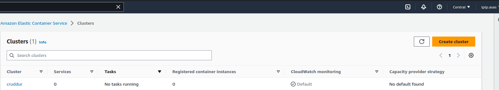

# Week 6 — Deploying Containers

## Running ECS

## Create ECS Cluster

```sh
aws ecs create-cluster \
--cluster-name cruddur \
--service-connect-defaults namespace=cruddur
```
### Creating ECS cluster from cli
Creating ECS cluster from cli can check


### Creating ECS cluster from console
Creating ECS cluster from console can check


### Namespace created
Namespace can check


## Create ECR repo and push image

### Login to ECR

```sh
aws ecr get-login-password --region $AWS_DEFAULT_REGION | docker login --username AWS --password-stdin "$AWS_ACCOUNT_ID.dkr.ecr.$AWS_DEFAULT_REGION.amazonaws.com"
```

### Create Base-image repo

```sh
aws ecr create-repository \
  --repository-name cruddur-python \
  --image-tag-mutability MUTABLE
```

#### Create Frontend Repo
```sh
aws ecr create-repository \
  --repository-name backend-flask \
  --image-tag-mutability MUTABLE
```

#### Create Backend Repo
```sh
aws ecr create-repository \
  --repository-name frontend-react-js \
  --image-tag-mutability MUTABLE
```
### ECR from AWS console
ECR from AWS console can check 

## Register Task Defintions

### Passing Senstive Data to Task Defintion

https://docs.aws.amazon.com/AmazonECS/latest/developerguide/specifying-sensitive-data.html
https://docs.aws.amazon.com/AmazonECS/latest/developerguide/secrets-envvar-ssm-paramstore.html

```sh
aws ssm put-parameter --type "SecureString" --name "/cruddur/backend-flask/AWS_ACCESS_KEY_ID" --value $AWS_ACCESS_KEY_ID
aws ssm put-parameter --type "SecureString" --name "/cruddur/backend-flask/AWS_SECRET_ACCESS_KEY" --value $AWS_SECRET_ACCESS_KEY
aws ssm put-parameter --type "SecureString" --name "/cruddur/backend-flask/CONNECTION_URL" --value $PROD_CONNECTION_URL
aws ssm put-parameter --type "SecureString" --name "/cruddur/backend-flask/ROLLBAR_ACCESS_TOKEN" --value $ROLLBAR_ACCESS_TOKEN
aws ssm put-parameter --type "SecureString" --name "/cruddur/backend-flask/OTEL_EXPORTER_OTLP_HEADERS" --value "x-honeycomb-team=$HONEYCOMB_API_KEY"
```

### Create Task and Exection Roles for Task Defintion


#### Create ExecutionRole

```sh
aws iam create-role \
    --role-name CruddurServiceExecutionRole \
    --assume-role-policy-document "{
  \"Version\":\"2012-10-17\",
  \"Statement\":[{
    \"Action\":[\"sts:AssumeRole\"],
    \"Effect\":\"Allow\",
    \"Principal\":{
      \"Service\":[\"ecs-tasks.amazonaws.com\"]
    }
  }]
}"
```

```sh
aws iam create-role \    
--role-name CruddurServiceExecutionPolicy  \   
--assume-role-policy-document file://aws/policies/service-assume-role-execution-policy.json
```

```sh
aws iam put-role-policy \
  --policy-name CruddurServiceExecutionPolicy \
  --role-name CruddurServiceExecutionRole \
  --policy-document file://aws/policies/service-execution-policy.json
"
```

```sh
aws iam attach-role-policy --policy-arn POLICY_ARN --role-name CruddurServiceExecutionRole
```


```json

       {
            "Sid": "VisualEditor0",
            "Effect": "Allow",
            "Action": "ssm:GetParameter",
            "Resource": "arn:aws:ssm:ca-central-1:387543059434:parameter/cruddur/backend-flask/*"
        }

```sh
aws iam attach-role-policy \
    --policy-arn arn:aws:iam::aws:policy/service-role/AmazonECSTaskExecutionRolePolicy \
    --role-name CruddurServiceExecutionRole
```

```json
{
  "Sid": "VisualEditor0",
  "Effect": "Allow",
  "Action": [
    "ssm:GetParameters",
    "ssm:GetParameter"
  ],
  "Resource": "arn:aws:ssm:ca-central-1:387543059434:parameter/cruddur/backend-flask/*"
}
```

#### Create TaskRole

```sh
aws iam create-role \
    --role-name CruddurTaskRole \
    --assume-role-policy-document "{
  \"Version\":\"2012-10-17\",
  \"Statement\":[{
    \"Action\":[\"sts:AssumeRole\"],
    \"Effect\":\"Allow\",
    \"Principal\":{
      \"Service\":[\"ecs-tasks.amazonaws.com\"]
    }
  }]
}"

aws iam put-role-policy \
  --policy-name SSMAccessPolicy \
  --role-name CruddurTaskRole \
  --policy-document "{
  \"Version\":\"2012-10-17\",
  \"Statement\":[{
    \"Action\":[
      \"ssmmessages:CreateControlChannel\",
      \"ssmmessages:CreateDataChannel\",
      \"ssmmessages:OpenControlChannel\",
      \"ssmmessages:OpenDataChannel\"
    ],
    \"Effect\":\"Allow\",
    \"Resource\":\"*\"
  }]
}
"

aws iam attach-role-policy --policy-arn arn:aws:iam::aws:policy/CloudWatchFullAccess --role-name CruddurTaskRole
aws iam attach-role-policy --policy-arn arn:aws:iam::aws:policy/AWSXRayDaemonWriteAccess --role-name CruddurTaskRole
```

### Create Json file
Create a new folder called `aws/task-defintions` and place the following files in there:

[backend-flask.json](https://github.com/iilness2/aws-bootcamp-cruddur-2023/blob/main/aws/task-definitions/backend-flask.json)
[frontend-react.json](https://github.com/iilness2/aws-bootcamp-cruddur-2023/blob/main/aws/task-definitions/frontend-react.json)

### Register Task Defintion

```sh
aws ecs register-task-definition --cli-input-json file://aws/task-definitions/backend-flask.json
```

```sh
aws ecs register-task-definition --cli-input-json file://aws/task-definitions/frontend-react-js.json
```
Task definition can check on AWS console

