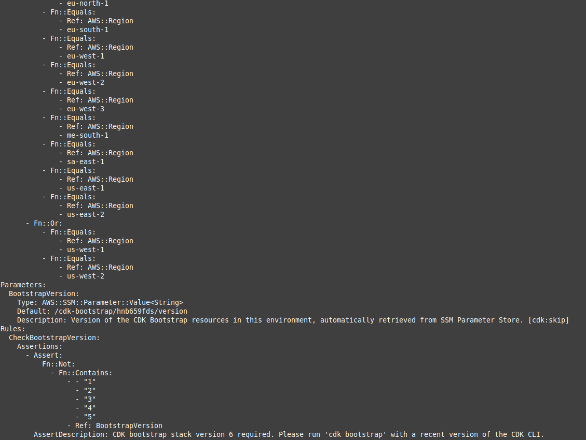
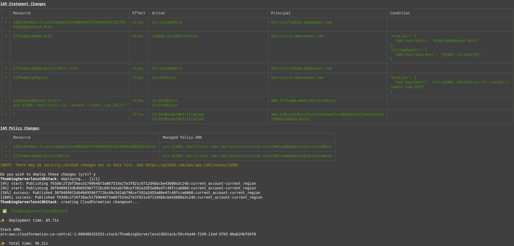
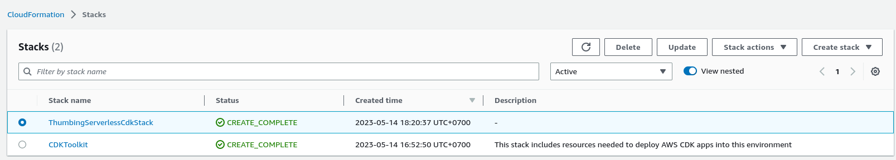
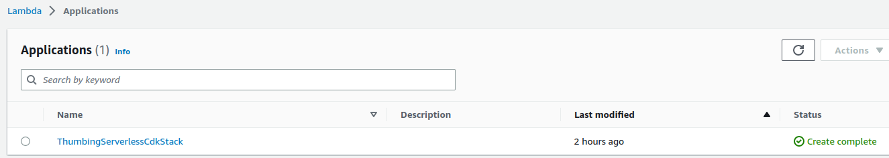
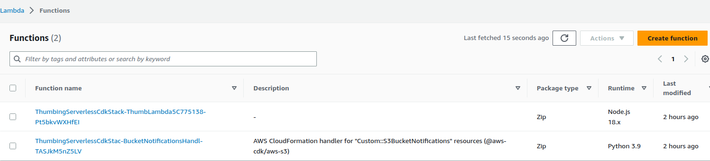
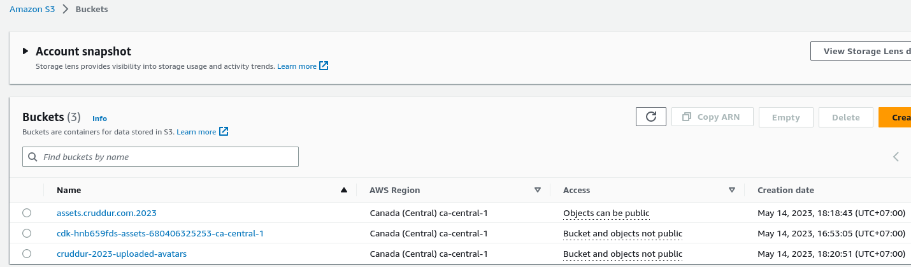

# Week 8 — Serverless Image Processing

## Prequisites
* install cdk

## Running CDK
### Install all library using npm install
When I running the cdk, need to make sure all the library already install before.
If still not got install, need to install the library that still left

### Build the app
```npm run build
```
### Running bootstrap
``` cdk bootstrap aws://680406325253/ca-central-1
```

### Check everything working
```cdk ls
```

or
```cdk synth
```


### Deploy the app
``` cdk deploy
```


### Result
cloudformation


lambda



S3

### Troubleshoot
* make sure upload s3 bucket name not created before
* make sure running cdk inside cdk folder
* dont forget to copy .env.example and make it as .env file
* asset s3 bucket need to create first before running the cdk

### Note
After week 8, In my opinion, for someone who aims to specialize in infrastructure, mastering the CDK using a programming language would require a significant amount of effort and a steep learning curve in order to achieve success.
